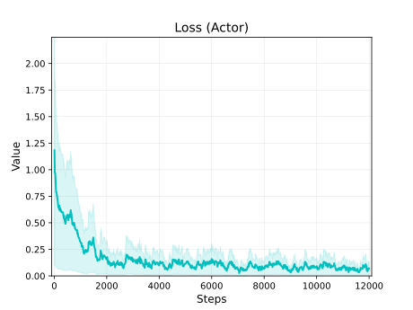
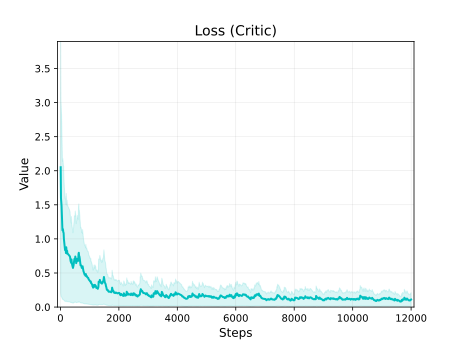
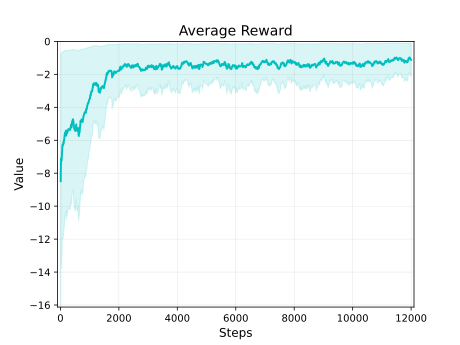
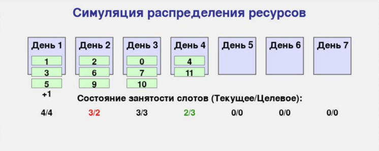
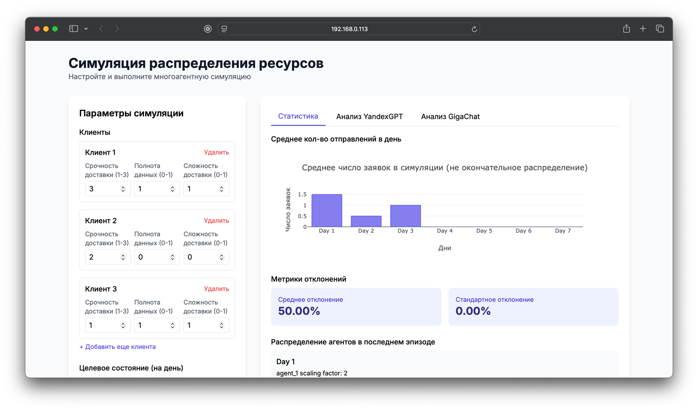

# Intelligent Explainable Scheduling Automation System

## Description

Imagine this scenario: You manage a transportation company with hundreds of clients, each with different preferences and needs. You are obligated to serve each of them by transporting their cargo, but your company's capabilities have limitations. Under these conditions, there is a need to allocate clients, considering the importance of some over others, and without exceeding the company's service capacity.

This project aims to solve this problem by automating the distribution of competing clients for service in critical areas and providing explanations for the decisions made by the system after allocation.

## Technical Features

Since the identified problem is NP-hard, the most accurate numerical solution can be achieved using Multi-Agent Reinforcement Learning (MARL) methods. By training a pool of reference intelligent agents on the most beneficial policy for them and the fairest for the company's capacities, simulations can be created for various client distribution scenarios.

The system utilizes the Multi-Agent Proximal Policy Optimization (MAPPO) algorithm, an extension of the Proximal Policy Optimization (PPO) algorithm designed for multi-agent environments. MAPPO allows multiple agents to learn policies simultaneously, making it suitable for environments where agents must cooperate and compete.

### Key Components:

- **Agents**: Each agent represents a customer or a service provider. Agents make decisions based on their policies, which are updated during training.
- **Environment**: The environment simulates the customer service scheduling scenario, including resource constraints and customer demands.
- **Policies**: The policies are neural networks that map states to actions. They are trained to maximize the cumulative reward.
- **Rewards**: The reward function is designed to incentivize efficient scheduling and fair resource allocation.

### Scheduler Module

The `scheduler.py` module, based on the PettingZoo library principles of environment creation, is the core of the system, responsible for:

- **Initial Scheduling**: Creating an initial schedule based on current demands and resources.
- **Dynamic Adjustments**: Making real-time adjustments to the schedule as new information becomes available.
- **Communication**: Facilitating communication between agents to coordinate their actions.

### Training the Model

The `train_mappo.py` script handles the training of the MAPPO model. Key steps include:

- **Initialization**: Setting up the environment, agents, and policies.
- **Training Loop**: Running episodes where agents interact with the environment, collect experiences, and update their policies.
- **Evaluation**: Periodically evaluating the performance of the agents to monitor progress.

### Testing the Model

The `test_mappo.py` script includes unit tests and integration tests to verify the correctness and robustness of the MAPPO model. Tests cover:

- **Agent Behavior**: Ensuring that agents make reasonable decisions.
- **Environment Dynamics**: Verifying that the environment behaves as expected.
- **Policy Updates**: Checking that policy updates lead to improved performance.

### Rescheduling Logic

The `rescheduling.py` and its Flask modification `app_rescheduling.py` modules contain the logic for adjusting schedules in response to changes in customer demands or resource availability. It includes:

- **Conflict Detection**: Identifying conflicts in the current schedule.
- **Resolution Strategies**: Implementing strategies to resolve conflicts, such as reallocating resources or adjusting service times.
- **Optimization**: Ensuring that the rescheduled plan is optimal with respect to the defined objectives.

## Results

The following code provides these results:





As you can see, the loss value decreases as the agents learn, while the average reward per episode increases. Thus, the effectiveness of the system has been experimentally proven.

The `human` render mode has its own interface:



The Flask web application's interface is presented below:



## Installation

1. Clone the repository:
   ```bash
   git clone https://github.com/southrussian/ppo_resource_management.git
   ```
2. Navigate to the project directory:
   ```bash
   cd rl-task-new
   ```
3. Install the required dependencies:
   ```bash
   pip install -r requirements.txt
   ```

## Dependencies

The main dependencies of the project are listed in the `requirements.txt` file. Make sure you have all the necessary libraries installed. Ensure you are using the latest available versions of the required libraries, especially `agilerl`, `pettingzoo`, and `gymnasium`.

## Usage

To train the MAPPO model, run:
```bash
python train_mappo.py
```

To test the MAPPO model, run:
```bash
python test_mappo.py
```

To launch the rescheduling application, run:
```bash
python app_reschedule.py
```

## License

This project is licensed under the [Apache License](LICENSE).

## Financial Support

The project is funded by the financial support of the Ministry of Science and Higher Education of the Russian Federation. D. Peregorodiev, A. Isakov. ITMO University. Saint-Petersburg, Russia. All rights reserved.
